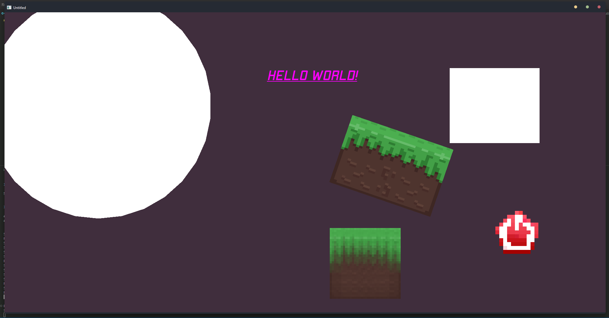

<p align="center">
<h1 align="center">💙 SFML.LD2D - 2D Level Designer for SFML (C++). 💛</h1>
</p>
<p align="center"><b>
  SFML.LD2D is easy and powerful level designer for SFML.<br>
  Level designer supports basic shapes, text, sprites, shader and a lot more, and more is coming.<br>
  Warning!: SFML.LD2D is very unstable. New updates are coming.<br><br>
  SFML.LD2D Stack:<br>
  <br>
  Level Designer features for v1.2:<br><br>
  Designer:<br><br>
  ⊛ Easy and simple.<br>
  ⊛ Basic Drag&Drop.<br>
  ⊛ More that five themes.<br>
  ⊛ More that 5 built-in fonts.<br>
  ⊛ Built-in color picker.<br>
  ⊛ Object editing in runtime.<br>
  ⊛ Easy UI.<br>
  ⊛ One-File API.<br><br>
  Features:<br><br>
  ⊛ Basic Shapes.<br>
  ⊛ Customizable text (fonts, colors, styles)<br>
  ⊛ Sprites.<br>
  ⊛ Built-in shaders for sprites.<br>
  ⊛ SFML.LD2D custom objects loading.<br>
  ⊛ Scene Importing/Exporting.<br>
  <h2 align="center">API for interacting with scene:</h2><br>

  ```cpp
  #include "SFML\include\SFML\Graphics.hpp"

  #include "sfml.ld2d\api\scene.h" // API.

  #include <iostream>

  int main() {
      sf::RenderWindow window(sf::VideoMode(2000, 1000), "Hello!");

      Scene scene("test_scene.2dscene"); // Import scene.

      window.setTitle(scene.projectName);

      sf::Clock clock;

      LevelObject& object = scene.getObject("SpriteShader"); // Get existing object by name.

      object.spritePath = "icon.png"; // Replace sprite path.

      while(window.isOpen()) {
          sf::Event event;

          while(window.pollEvent(event)) {
              if(event.type == sf::Event::Closed) {
                  window.close();
              }
          }

          window.clear(scene.getBackground()); // Clear window with scene color.

          scene.drawScene(window);

          window.display();
      }

      return 0;
  }
  ```

  test_scene.2dscene:

  ```
  <SCENE:Untitled:0.250980:0.180392:0.239216>
  <RECTANGLE:Rect:299:250:1631:311:0:false:1:1:1:1>
  <CIRCLE:Circle:25:25:250:250:15:0:false:1:1:1:1>
  <TEXT:Text:Hello World!:builtin@apex:46:false:true:true:873:180:0:false:1:0:1>
  <SPRITE:SpriteShader:0.200000:0.200000:1707:736:ground.png:0:PIXELATE:0.080000:false>
  <SPRITE:SpriteBlur:0.200000:0.200000:1200:837:ground.png:0:BLUR:0.130000:false>
  <SPRITE:GroundObject11:0.300000:0.200000:1287:512:ground.png:19:NO_SHADERS:0.130000:false>
  <LDOBJ:ground>
  ```

  Result:
  
  Yay!

  <h2 align="center">Installation.</h2><br>
  1. Download release.<br>
  2. Unpack <code>sfml.ld2d</code> to your main project directory.<br>
  3. After unpacking run <code>compile.bat</code> in <code>sfml.ld2d</code>.<br>
  4. Wait for compilation (less than 10 seconds).<br>
  5. Run <code>ld2d.exe</code><br>
  6. Done!<br>

  <h2 align="center">Documentation.</h2><br>
  Click <a href="https://github.com/xzripper/SFML.LD2D/blob/main/Documentation.md">here</a> for documentation.
</b></p>

<hr>

<p align="center"><b>SFML.LD2D v1.0 MIT License.</b></p>
